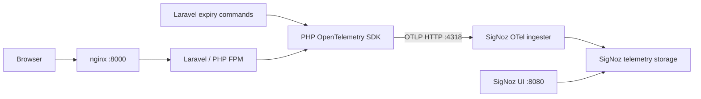

# Add observability with SigNoz and OpenTelemetry

## Original request

> Please add observability to this project. Use SigNoz and OTel (OpenTelemetry). Use Docker to run these services.

## Purpose of this document

This is an implementation plan for a junior developer or an AI coding agent. Complete the phases in order. Each phase includes files to change, implementation steps, and a completion check. The checkboxes describe future work; writing this plan does not mean that the feature has been implemented.

Documentation and repository structure were checked on **2026-09-26**. Resolve and record compatible dependency versions in Phase 0 before copying SDK examples. Do not assume that examples from a different Laravel or SigNoz version will work here.

## 1. Expected outcome

A developer can start the application and a local SigNoz stack with Docker, perform an application request, and use SigNoz to answer:

- Which route was called, how long did it take, and did it fail?
- Which application log events belong to that request?
- Are request volume, server errors, or latency increasing?
- Did document expiry and subscription expiry finish successfully?
- How long did payment fulfillment take inside its parent request or command?

The application must continue serving requests and running commands when observability is disabled or SigNoz is unavailable.

### Terms used below

| Term | Meaning in this project |
| --- | --- |
| Trace | A record of one request or command and its instrumented operations. |
| Span | One timed operation inside a trace. |
| Metric | An aggregated measurement, such as request count or duration. |
| Correlated log | A structured event containing the active trace and span identifiers. |
| OpenTelemetry SDK | PHP libraries used to create and export telemetry. |
| OTLP | The protocol used to send OpenTelemetry data. Use HTTP with protobuf encoding here. |
| Collector / ingester | The service receiving telemetry and forwarding it to SigNoz storage. |
| SigNoz | The application used to inspect telemetry and build dashboards. |
| Foundry | SigNoz's current tool for generating its Docker deployment. |

## 2. Repository facts to preserve

Read these files before implementing their corresponding phases.

| Existing file or component | Current behavior and implementation consequence |
| --- | --- |
| `composer.json` | Laravel `^10.10`, PHP `^8.3`, Guzzle `^7.2`; no OTel dependencies yet. |
| `docker-compose.yml` | Runs `app`, `nginx`, `postgres`, `redis`, `mailpit`, and `scheduler`. Application URL is `http://localhost:8000`. |
| `docker/php/Dockerfile` | PHP 8.3 FPM image shared by the app and scheduler. |
| Root `Dockerfile` | Production image uses separate Composer, frontend, and PHP runtime stages. New runtime dependencies must be installed in its vendor stage too. |
| `docker/render/supervisord.conf` | Production runs PHP FPM, nginx, and the scheduler together. Account for HTTP and CLI service identities. |
| `app/Http/Kernel.php` | Laravel 10 middleware registration belongs here. |
| `config/app.php` | Laravel 10 service provider registration belongs here. Do not use Laravel 11's `bootstrap/providers.php`. |
| `app/Exceptions/Handler.php` | Already handles JSON and Inertia responses. Preserve its rendering behavior. |
| `config/logging.php` | Existing application logs go through Laravel channels. Keep them working. |
| `app/Console/Kernel.php` | Schedules `documents:expire` and `subscriptions:expire`. |
| `app/Services/PakasirFulfillmentService.php` | Contains payment fulfillment and provider interaction suitable for a child span. |
| `app/Services/LoginOtpService.php` | Handles sensitive OTP data; do not capture its inputs or Redis keys. |
| `tests/Unit` and `tests/Feature` | Existing PHP tests. Follow their fixtures and mocking conventions. |

At planning time, `.env.example` is absent from this checkout. Create a dedicated `.env.observability.example`; do not overwrite `.env` or reconstruct a full application environment from secrets.

## 3. Implementation decisions

These decisions keep the first implementation bounded and reproducible.

1. Use the **PHP OTel SDK with explicit instrumentation** in Laravel middleware and selected commands/services. No automatic instrumentation package or PECL OTel extension is needed for this approach. Automatic PHP instrumentation has additional extension requirements; it is a separate future choice. [PHP automatic instrumentation](https://opentelemetry.io/docs/zero-code/php/auto/)
2. Implement **traces, metrics, and curated application logs**. Forward only events defined in this plan; arbitrary existing log messages can contain signing URLs or other secrets.
3. Send all three signals directly to **SigNoz's bundled OTel ingester** over an internal Docker network. A second generic collector is unnecessary for this first implementation.
4. Run SigNoz in its own Compose project, with its own storage volumes. Keep the application's database separate from SigNoz's metadata database.
5. Add an opt-in application Compose overlay. The existing application Compose command must work without the SigNoz stack.
6. Default application telemetry to disabled. Enabling the overlay opts local development into telemetry.
7. Make the PHP integration compatible with the production image, but do not deploy a production SigNoz server as part of this issue.



### Included in this issue

- Laravel request spans, including failures rendered into HTTP responses.
- Request count and duration metrics independent of trace sampling.
- Correlated, privacy-filtered request, command, and error events.
- Spans and metrics for both existing expiry commands.
- One child span around Pakasir fulfillment.
- Docker setup, a dashboard, a local smoke command, tests, and operating instructions.

### Follow-up work

Browser instrumentation, automatic SQL/Redis instrumentation, all outbound HTTP calls, host/container metrics, queue worker instrumentation, production hosting, and external alert delivery are outside this first implementation. There is no queue worker service in the current Compose file. Static assets served directly by nginx will not appear as Laravel request spans.

## 4. Proposed files

Keep responsibilities small. Equivalent names are acceptable if the final runbook uses the actual names.

| File | Action / responsibility |
| --- | --- |
| `docker/observability/signoz/casting.yaml` | Add: Foundry configuration, pinned images, networking and port patches. |
| `docker/observability/signoz/casting.yaml.lock` | Add: reviewed Foundry lock file, if generated by the selected release. |
| `docker/observability/versions.md` | Add: exact versions, image digests, compatibility notes, and upstream references. |
| `docker-compose.observability.yml` | Add: app/scheduler telemetry configuration and shared network. |
| `.env.observability.example` | Add: nonsecret configuration examples. |
| `.gitignore` | Update: ignore generated Foundry `pours/` and local credentials. |
| `composer.json`, `composer.lock` | Update: compatible OTel runtime dependencies. |
| `config/observability.php` | Add: application telemetry settings. |
| `app/Providers/ObservabilityServiceProvider.php` | Add: lazy service registration and lifecycle hooks. |
| `config/app.php` | Update: register that provider. |
| `app/Observability/Telemetry.php` | Add: small application-facing API for spans, events, measurements, flush, and shutdown. |
| `app/Observability/TelemetryFactory.php` | Add: SDK providers, transports, resources, and processors. |
| `app/Observability/TelemetryAttributes.php` | Add: event and attribute allowlists and normalization. |
| `app/Http/Middleware/TraceRequest.php` | Add: one server span per Laravel request. |
| `app/Http/Kernel.php` | Update: register middleware near the start of the global stack. |
| `app/Exceptions/Handler.php` | Update only if needed: record a sanitized reportable exception event. |
| Existing expiry command classes | Update: wrap command execution without changing business behavior. |
| `app/Services/PakasirFulfillmentService.php` | Update: wrap fulfillment in a child span. |
| `app/Console/Commands/ObservabilitySmoke.php` | Add: local/testing-only command emitting synthetic telemetry. |
| `tests/Unit/Observability/` | Add: configuration, privacy, lifecycle, and disabled-mode tests. |
| `tests/Feature/Observability/` | Add: request, command, and service integration tests. |
| `docs/observability.md` | Add: setup, queries, troubleshooting, rollback, and production considerations. |
| `docs/observability/dashboard.json` | Add: dashboard exported from the chosen SigNoz version. |
| `README.md` | Update: short link to the observability runbook. |

## Phase 0 — Establish compatible versions

**Goal:** avoid building the integration against incompatible examples or moving image tags.

1. Inspect the files listed in section 2 and check the working tree. Preserve unrelated changes.
2. Confirm Docker Engine and Docker Compose v2 are available on the intended development host.
3. Read the current official SigNoz Docker installation instructions. The documentation reviewed for this plan uses Foundry and marks the old bundled `deploy/docker` installation as deprecated. Allow at least the documented 4 GB for SigNoz, plus memory for this application. For Windows/WSL, check the documented ClickHouse Keeper compatibility caveat before choosing the Docker engine. [SigNoz Docker installation](https://signoz.io/docs/install/docker/)
4. Select a stable Foundry release and record its exact version and installation/checksum instructions. Use the compatible SigNoz component set generated by that release as the starting point.
5. Record exact image tags or digests for every generated SigNoz service. Do not independently upgrade ClickHouse or Keeper beyond the supported set.
6. Resolve stable PHP packages compatible with PHP 8.3 and the existing lock file:
   - `open-telemetry/api`
   - `open-telemetry/sdk`
   - `open-telemetry/exporter-otlp`
   - `php-http/guzzle7-adapter`
7. Check that protobuf encoding is available through the resolved dependencies. HTTP/protobuf does not require gRPC. The official exporter documentation describes the exporter and HTTP-client requirements. [PHP exporters](https://opentelemetry.io/docs/languages/php/exporters/)
8. Save the results in `docker/observability/versions.md`. Include the exact SDK APIs used for log export, metric temporality, timeouts, and flushing. Commit `composer.lock` with the implementation.

Suggested dependency installation command, after checking compatibility:

```bash
docker compose exec app composer require open-telemetry/api open-telemetry/sdk open-telemetry/exporter-otlp php-http/guzzle7-adapter
```

Do not add `--ignore-platform-reqs`, development stability overrides, or unrelated dependency upgrades to make installation pass. If a package requires a major Laravel/PHP upgrade, find a compatible stable version first.

**Done when:** the version document has concrete versions, runtime dependencies resolve in PHP 8.3, and there are no `latest` tags in the new observability deployment. Existing application image tags are outside this issue.

## Phase 1 — Run SigNoz with Docker

**Goal:** a reproducible, isolated SigNoz stack reachable at `http://localhost:8080`.

1. Create `docker/observability/signoz/` and a Foundry casting file using the official Compose example. Start from:

   ```yaml
   apiVersion: v1alpha1
   kind: Installation
   metadata:
     name: esign-observability
   spec:
     deployment:
       flavor: compose
       mode: docker
   ```

2. Add the version pins selected in Phase 0 using the selected release's component configuration schema. Do not treat the minimal example above as the finished deployment. [Foundry casting reference](https://github.com/SigNoz/foundry/blob/main/docs/reference/casting-file.md)
3. Generate the deployment once. Inspect the generated Compose file to identify its ingester, UI service, networks, volumes, and published ports. Use those actual service keys in subsequent patches.
4. Create an external Docker network named `esign-observability`. Add it to the generated Compose configuration through Foundry patches. Attach **only the ingester** to that shared network, retaining its existing internal networks. Give it the network alias `otel-collector`.
5. Ensure the ingester's OTLP HTTP receiver listens on `0.0.0.0:4318` inside its container. Retain the generated SigNoz pipelines and exporters for all three signals. Do not replace them with a generic collector configuration.
6. Keep telemetry storage and metadata services internal. Remove unnecessary host port publications, including OTLP ports, and bind the UI to `127.0.0.1:8080`. Leave the optional MCP service disabled because its port can conflict with the application's port 8000.
7. Preserve named storage volumes. Make all required deployment changes in `casting.yaml`; ignore generated `pours/`. Foundry applies `spec.patches` to generated files, and patch paths must match the selected version's output. [Foundry patches](https://github.com/SigNoz/foundry/blob/main/docs/concepts/patches.md)
8. Review generated and lock files for credentials before committing anything. Put local credentials in ignored configuration where the selected release supports it. Document first-run account creation.
9. Start the generated Compose project with a fixed project name, `esign-observability`, and confirm all required services become healthy.

Command sequence to document, run from the repository root except for the indicated directory change:

```bash
docker network create esign-observability
cd docker/observability/signoz
foundryctl gauge -f casting.yaml
foundryctl forge -f casting.yaml
docker compose -p esign-observability -f pours/deployment/compose.yaml config --quiet
docker compose -p esign-observability -f pours/deployment/compose.yaml up -d
docker compose -p esign-observability -f pours/deployment/compose.yaml ps
```

If the external network already exists, inspect and reuse it. The final runbook must identify the actual ingester service name and how to inspect its logs.

**Done when:** the UI loads, required services are healthy, storage survives a restart, and the ingester has the `otel-collector` alias on `esign-observability`. Application port 8000 remains available.

## Phase 2 — Add opt-in application configuration

**Goal:** enable telemetry without making SigNoz a dependency of application startup.

1. Add `docker-compose.observability.yml`.
2. Attach both `app` and `scheduler` to their existing `default` network and external `esign-observability` network. Keeping `default` is necessary for database and Redis access.
3. Set environment variables for both services. Configure `esign-api` as the HTTP service name and `esign-scheduler` as the CLI service name. Choose between these configured values at runtime, so a shared Laravel configuration cache does not give HTTP and CLI the same identity.
4. Do not add a `depends_on` relationship from application services to SigNoz. A stopped collector must not prevent application startup.
5. Add `config/observability.php`. Access environment values here and use `config()` throughout application code so Laravel configuration caching works.
6. Add `.env.observability.example` with these documented values:

   ```dotenv
   OBSERVABILITY_ENABLED=false
   OTEL_SERVICE_NAME=esign-api
   OBSERVABILITY_CONSOLE_SERVICE_NAME=esign-scheduler
   OTEL_SERVICE_VERSION=local
   OTEL_EXPORTER_OTLP_ENDPOINT=http://otel-collector:4318
   OTEL_EXPORTER_OTLP_PROTOCOL=http/protobuf
   OTEL_TRACES_SAMPLER_ARG=1.0
   OBSERVABILITY_EXPORT_TIMEOUT_MS=200
   ```

7. Make the overlay set `OBSERVABILITY_ENABLED` to true by default when explicitly selected, while allowing an explicit false override. Keep the application configuration default false.
8. Define `deployment.environment.name` from `config('app.env')`, and `service.namespace` as `esign-saas`. Supply `service.version` from release configuration; do not execute Git on every request.
9. Use a parent-based trace sampler with the configured ratio for locally created roots. Validate that the ratio is within 0–1. Start at 1.0 locally. Metrics must still record when traces are not sampled.
10. Treat the endpoint as a base URL and construct exactly one `/v1/traces`, `/v1/metrics`, or `/v1/logs` suffix. `localhost` inside `app` refers to the app container, not SigNoz.
11. Check that PHP FPM sees the intended container configuration. If its pool clears required variables, explicitly pass those variables in an FPM pool configuration. Check CLI and FPM separately.
12. In the factory, select the configured console service name when Laravel is running in the console, and the configured `OTEL_SERVICE_NAME` otherwise. Make this selection after loading configuration, not while generating the configuration cache. This also covers the shared production supervisor image. Do not hard-code a local Docker endpoint into that image.

The sample environment file is documentation. Do not automatically replace the developer's `.env`. Document whether a variable is read by Compose interpolation or passed into the container; these are different operations.

Commands from the repository root:

```bash
docker compose -f docker-compose.yml -f docker-compose.observability.yml config --quiet
docker compose -f docker-compose.yml -f docker-compose.observability.yml up -d --build
```

**Done when:** application networking still works, service identities differ, and the base Compose setup remains usable without creating the observability network.

## Phase 3 — Build the PHP telemetry service

**Goal:** a single, testable place owns SDK setup and export lifecycle.

1. Implement `TelemetryFactory` to build a tracer provider, meter provider with an exporting reader, and logger provider. Share the resource attributes from Phase 2. Use OTLP HTTP/protobuf exporters for each signal.
2. Consult the installed SDK's examples for actual constructor and builder signatures. The PHP documentation covers provider setup, span activation, metrics, and explicit collection. [PHP instrumentation](https://opentelemetry.io/docs/languages/php/instrumentation/)
3. Implement a small `Telemetry` wrapper with application-facing operations equivalent to:
   - `startRequest(...)` / `finishRequest(...)`
   - `withinSpan(name, safeAttributes, callback)`
   - `runCommand(commandName, callback)`
   - `event(eventName, safeAttributes, severity)`
   - `recordExceptionType(Throwable)`
   - `forceFlush()` and `shutdown()`
4. Keep SDK-specific types inside the observability classes where practical. Allow providers/exporters and the clock to be substituted in tests. Disabled mode must use no-op behavior and make no network calls.
5. Register the service lazily in `ObservabilityServiceProvider`, then register that provider in `config/app.php`. Running Composer discovery, migrations, or unrelated Artisan commands must not start telemetry transport unnecessarily.
6. Use bounded batching for spans and logs. Set a small queue limit, such as 256 records per process, and verify the chosen SDK's behavior. Do not assume PHP FPM has a permanent background exporter thread.
7. Apply `OBSERVABILITY_EXPORT_TIMEOUT_MS` to the actual HTTP transport, including connection and response limits. Disable SDK transport retries for this first implementation. Bound the entire flush cycle to one second, including all three signals; test this bound rather than assuming each timeout adds up correctly.
8. Make export/setup failures nonfatal. Catch failures only at telemetry boundaries; do not swallow business exceptions. SDK diagnostics must bypass the OTel logger to prevent recursion. Do not print exporter URLs, credentials, or serialized payloads in fallback messages.
9. Register a Laravel application termination hook to flush initialized providers. End request spans before this hook. Make shutdown idempotent and avoid registering multiple competing automatic shutdown handlers.
10. At the end of an instrumented command, flush explicitly. In a reused CLI process, keep providers alive for the next operation; shut them down only at final process termination. Every activated scope must be detached in a `finally` block.
11. Configure metric temporality deliberately. Prefer delta aggregation for short PHP request lifetimes, using the selected SDK's supported API. Verify SigNoz ingestion with several separate requests. Never ship cumulative counters that reset each request under the same identity and produce incorrect rates. If the selected ingester requires conversion, configure and document its supported delta-to-cumulative path before continuing.

**Done when:** synthetic spans, a metric, and a log reach SigNoz; disabled mode performs zero exports; transport failure cannot change a callback's result or exception; repeated operations do not retain the previous active span.

## Phase 4 — Instrument HTTP requests

**Goal:** one correctly named server span and one measurement set per Laravel request.

1. Add `TraceRequest` near the start of the global middleware list in `app/Http/Kernel.php` so it also observes responses produced by later middleware.
2. Extract valid W3C trace context from `traceparent`/`tracestate` using the SDK propagator. Ignore malformed context safely. Do not import or export arbitrary baggage.
3. Start and activate a server span before calling `$next($request)`. Initially use a safe generic name; after routing, rename it to the normalized method plus **route template**, such as `GET /documents/{document}`.
4. Use the matched route's URI template, never the concrete request URL. For unmatched routes, use the constant `unmatched`. Normalize unrecognized methods to a bounded value such as `_OTHER`.
5. Record only the allowlisted fields in the telemetry contract below. Read the final HTTP status from the response. Mark 5xx responses as span errors; do not mark all validation/authentication 4xx responses as server failures.
6. Laravel can render exceptions inside its pipeline and return a response to this middleware. Handle both returned 5xx responses and thrown exceptions. A `catch` block alone will miss some failures.
7. If adding a report hook in `app/Exceptions/Handler.php`, preserve existing behavior and attach only the exception class to the active span/event. Deduplicate error recording within a request. Never call raw `recordException($exception)` unless its payload is explicitly sanitized first.
8. While the request span is still active, emit `http.request.completed` and record request count/duration. Then end the span and detach its context in `finally`. Rethrow original exceptions unchanged.
9. Use monotonic time for durations. Define duration as time through Laravel response creation; document that it excludes streamed body delivery and export time.
10. Register a test-only failure route in the test harness. Do not add a public debug endpoint to production routes.

Lifecycle order:

```text
extract context -> start and activate span -> execute application
-> obtain response/status -> emit safe event and metrics
-> end span -> detach scope -> flush during application termination
```

**Done when:** successful, redirect, validation, missing-route, and server-error responses produce the expected telemetry without changing response content/status. Token-bearing URLs appear only as route templates.

## Telemetry contract and privacy rules

Implement these rules centrally in `TelemetryAttributes`, with tests. Signing URLs, OTPs, payment data, and document contents make broad request/log capture unsuitable here.

### Allowed fields

| Signal | Allowed fields / values |
| --- | --- |
| Resource | `service.name`, `service.namespace`, `service.version`, `deployment.environment.name`. |
| HTTP span | `http.request.method`, `http.route`, `http.response.status_code`, optional `error.type` as an exception class or fixed category. |
| Command span | `app.command.name` from the fixed command allowlist, `app.command.exit_code`, `app.outcome` as `success` or `failure`. |
| Fulfillment span | Fixed operation name `payment.fulfill`; `payment.provider=pakasir`; optional fixed result category derived from existing behavior. |
| Log | Fixed event name/body, severity, allowed operation fields, and native OTel trace/span context. |
| Metric dimensions | Method/route/status for HTTP; command/outcome for commands. No per-user or per-request dimensions. |

### Never export

- Authorization headers, cookies, sessions, passwords, API keys, or OTP values.
- Signing tokens, concrete signing URLs, URL query strings, or arbitrary request headers.
- Request/response bodies, document contents, signatures, storage paths, or uploaded filenames.
- Email addresses, user/document/order identifiers, payment amounts, card details, or provider payloads.
- SQL statements/bindings, Redis keys, exception messages/stack traces, or serialized request/model/exception objects.

Use fixed event names as log bodies. Reject attributes outside the allowlist and cap string lengths. Filtering must happen **before** export; deleting fields in SigNoz after ingestion is insufficient. A denylist alone will miss newly introduced sensitive fields.

## Phase 5 — Add metrics and correlated logs

**Goal:** useful aggregates and searchable events without collecting arbitrary application data.

1. Create these custom instruments once per provider:

   | Instrument | Type | Unit | Record when |
   | --- | --- | --- | --- |
   | `esign.http.requests` | Counter | `{request}` | Once per completed Laravel request. |
   | `esign.http.duration` | Histogram | `s` | Once per completed Laravel request. |
   | `esign.command.runs` | Counter | `{run}` | Once per instrumented command completion. |
   | `esign.command.duration` | Histogram | `s` | Once per instrumented command completion. |

2. Start with duration boundaries `[0.005, 0.01, 0.025, 0.05, 0.1, 0.25, 0.5, 1, 2.5, 5, 10, 30]` seconds if the selected SDK supports explicit histogram views. Record the actual configuration in the runbook.
3. Record measurements even when the current trace is unsampled. Do not use trace count as a substitute for total request count.
4. Use the SDK logger behind `Telemetry::event()` to export these curated events:
   - `http.request.completed`
   - `application.exception` with sanitized exception class only
   - `command.completed`
   - `observability.smoke`
5. Emit events while their span is active so native OTLP `TraceId` and `SpanId` fields are populated. A JSON string containing `trace_id` alone is not sufficient for SigNoz correlation.
   Use INFO for normal completion, WARN for HTTP 4xx completion, and ERROR for HTTP 5xx, failed commands, and sanitized exception events.
6. Keep existing Laravel file/stderr logging intact. Do not attach an unrestricted OTLP handler to the existing default log stack or read entire log files into the collector.
7. Verify metrics across at least ten independent HTTP requests and several CLI invocations. Check aggregation, units, reset handling, and label cardinality. A single visible data point is not enough to validate PHP metrics.

**Done when:** SigNoz shows correct counts/durations, a request event opens its trace, and changing a document identifier does not create a new metric series.

## Phase 6 — Instrument commands and payment fulfillment

**Goal:** useful operational coverage outside the request middleware.

1. Read `app/Console/Commands/ExpireDocuments.php` and `app/Console/Commands/ExpireSubscriptions.php`, plus their existing tests under `tests/Unit/Console/`. Preserve the `StripeService` injection in `ExpireSubscriptions::handle()`.
2. Wrap each command's existing execution in `Telemetry::runCommand()`. Keep all existing scheduling, database operations, locking, output, and return codes intact. A small extracted private method is acceptable if needed to keep `handle()` readable.
3. Start an internal root span named `artisan documents:expire` or `artisan subscriptions:expire`. Record a nonzero exit code as failure even if no exception was thrown.
   Here, success means the command returned zero. Existing commands can log warnings and still return success; do not change that business policy as part of instrumentation.
4. In all exits, emit the command event/metrics, end and detach its span, and flush. Rethrow the original business exception unchanged.
5. Do not create a never-ending root span for `schedule:work`. Trace the actual units of work. Account for commands that execute in separate processes.
6. Wrap `PakasirFulfillmentService::fulfill()` with `Telemetry::withinSpan('payment.fulfill', ...)`. When called inside a request or instrumented command, its span must be a child of that operation.
7. Preserve the service's existing return value, transaction boundaries, idempotency checks, and exception behavior. Do not move payments into or out of database transactions for telemetry.
8. Test fulfillment with the existing mocked provider pattern. No real payment, Stripe, Pakasir, or email calls are needed to verify this feature.

**Done when:** both commands have duration/status telemetry; fulfillment appears under its parent; failures preserve the original behavior; multiple operations in one process do not share stale context.

## Phase 7 — Add automated verification

**Goal:** detect privacy leaks, broken lifecycle handling, and behavior changes before deployment.

Use in-memory exporters or injected fakes for PHP tests. Unit/feature tests must not require a running SigNoz server or network access. Do not make a live exporter the default in `phpunit.xml`.

Required test cases:

| Area | Cases and assertions |
| --- | --- |
| Configuration | Disabled by default; cached config works for both HTTP and CLI service names; invalid ratio/protocol handled predictably; signal endpoint suffix appears exactly once. |
| HTTP | 200, redirect, 422, 404, returned/rendered 500, and thrown exception; one span and measurement set each. |
| Context | Valid remote parent preserved; malformed header ignored; child has correct parent; scope detached after failure. |
| Logs | Request event has matching native trace/span identifiers; log severity matches outcome; arbitrary context is rejected. |
| Metrics | Durations use seconds; counts are correct across operations; unsampled traces still produce measurements. |
| Commands | Success, nonzero exit, and thrown exception; original results preserved; flush occurs. |
| Fulfillment | Existing successful/already-processed/error paths preserve behavior with telemetry enabled and disabled. |
| Privacy | Canary secrets in URL token, query, headers, body, exception message, and log attributes never appear in any exported payload. |
| Export failure | Throwing exporter and timeout simulation cannot change response/command outcome or recursively log. |
| Lifecycle | Two requests/commands in one process have independent context; termination does not double-export; shutdown is idempotent. |

Add a local/testing-only `observability:smoke` command:

1. Reject execution outside `local` and `testing` before producing telemetry.
2. Print a clear message and return nonzero if observability is disabled.
3. Start a synthetic span, increment a dedicated `esign.observability.smoke` counter with unit `{run}`, emit `observability.smoke`, end the span, and flush. Do not increment real HTTP or expiry-command counters for this synthetic operation.
4. Print its trace ID and whether export was attempted; do not claim successful SigNoz ingestion merely because the SDK accepted a record.
5. Support a synthetic failure option that records an error and returns nonzero without touching application data or external services.

Suggested implementation verification commands:

```bash
docker compose exec app php artisan test --filter=Observability
docker compose exec app php artisan test
npm test
docker compose exec app composer check-platform-reqs
```

Also build the root production `Dockerfile` and confirm runtime dependencies and PHP FPM startup. Run configuration-cache checks in a disposable test container so the developer's normal local configuration is not left cached with test values.

Explicitly exercise kernel/application termination in lifecycle tests; an in-process test request may not perform the same shutdown sequence as a real PHP FPM request.

**Done when:** new tests and existing suites pass, and test output contains no real credentials or telemetry payloads.

## Phase 8 — Validate the full Docker flow and write the runbook

**Goal:** a new developer can reproduce the feature without knowing OTel internals.

1. Start SigNoz using Phase 1, then the application with the overlay from Phase 2.
2. Open `http://localhost:8000` and exercise a harmless existing route repeatedly. Use synthetic local data for authenticated flows.
3. Run the smoke command from the telemetry-enabled app container:

   ```bash
   docker compose -f docker-compose.yml -f docker-compose.observability.yml exec app php artisan observability:smoke
   ```

4. In SigNoz, find `esign-api`, locate the printed trace ID, and open its correlated log. Allow ingestion time and verify the UI time range.
5. In a disposable local database, run both expiry commands and find `esign-scheduler` telemetry. Use synthetic non-Stripe fixtures or mocked providers. These commands change data; even `subscriptions:expire --dry-run` can call Stripe for Stripe-backed records, so a dry run alone does not isolate external effects.
6. Check the request metrics against a known request count. Test across different PHP requests and worker processes, not only inside one test process.
7. Create a dashboard filtered by service and environment with:
   - Request rate, server-error rate, and p50/p95 request duration by route.
   - Command runs by outcome and command duration.
   - A link or documented query for recent error events/traces.
8. Use the instrument names from Phase 5. Verify the actual metric names and histogram representation in the selected SigNoz release before writing queries. Export the working dashboard to `docs/observability/dashboard.json`; do not invent an untested dashboard JSON schema.
9. Document one optional server-error alert recipe, including a minimum traffic threshold and no-data behavior. External email/Slack delivery is not required by this issue.
10. Stop the actual SigNoz ingester service and repeat a harmless request and the smoke command. Verify application availability, bounded export overhead, and nonrecursive diagnostics. Restart the ingester and confirm later telemetry arrives. Loss of telemetry during an outage is acceptable for this local first version; blocking the application is not.
11. Disable telemetry, recreate app/scheduler containers, and verify no new application telemetry is emitted. Then confirm the base Compose setup works independently.
12. Restart the SigNoz project without deleting volumes and verify saved dashboard/data persistence.

The final `docs/observability.md` must include:

- Prerequisites and exact pinned tool/image versions.
- Copyable setup commands with their working directories.
- First-run SigNoz account setup, UI URL, service names, and all configuration variables.
- How to start, stop, inspect logs, regenerate Foundry output, and update version pins.
- Metric definitions, units, sampling behavior, privacy policy, and known coverage limits.
- The actual ingester service name and its network alias.
- How to import the dashboard and reproduce the smoke checks.
- Local storage/retention guidance and how to inspect disk use.
- Production requirements: a reachable private/TLS endpoint, credentials outside Git, resource sizing, sampling, retention, and separate service identities. Do not expose an unauthenticated collector publicly.
- The recovery steps below.

### Troubleshooting checklist

| Symptom | Check in this order |
| --- | --- |
| App cannot resolve `otel-collector` | Both stacks use the external network; alias belongs to the ingester; app retained its default network. |
| UI loads but no traces | Enabled flag, FPM environment, service/time filters, `/v1/traces` endpoint, receiver bind address, span end and flush. |
| Traces work but metrics/logs do not | Their providers/exporters, signal endpoint paths, ingester pipelines, metric temporality, and log scope timing. |
| Wrong counts after multiple requests | Metric temporality/reset behavior and duplicate collection/export. |
| CLI works but HTTP does not | PHP FPM environment/configuration and application termination hook. |
| Requests slow down when SigNoz stops | Transport connect/read timeout, retries, flush deadline, and recursive diagnostics. |
| Spans share the wrong trace | Scope detachment and mutable state surviving between operations. |
| Keeper repeatedly crashes on Windows | Current SigNoz host/engine compatibility guidance from Phase 0. |

### Disable and rollback

1. Set `OBSERVABILITY_ENABLED=false` in the configuration source actually used by the running services, rebuild cached Laravel configuration if applicable, and recreate/restart app and scheduler.
2. To remove the overlay entirely, explicitly recreate app and scheduler with the base Compose file. Merely omitting `-f` from a later `exec` command does not remove environment settings from existing containers.
3. Stop the separate SigNoz Compose project when desired. Preserve its volumes.
4. Do not use `docker compose down -v` as a routine rollback command. Do not alter the application's database to disable telemetry.
5. Re-enable by restoring configuration, starting SigNoz, and repeating the smoke checks.

**Done when:** another developer can follow the runbook from a clean checkout with an existing working application environment, and all three signals are visible in SigNoz.

## Final acceptance checklist

- [ ] All new dependency/image versions are recorded and reproducible.
- [ ] SigNoz and its required services run through Docker.
- [ ] App runs with the base Compose file and observability disabled.
- [ ] App and scheduler export through the internal OTLP HTTP endpoint when enabled.
- [ ] Request spans use route templates and include the correct final status.
- [ ] A fulfillment child span appears beneath its request/command parent.
- [ ] Both expiry commands export outcome and duration.
- [ ] Request/command metrics aggregate correctly across process lifetimes.
- [ ] Curated logs link to their traces through native OTel context.
- [ ] Canary privacy tests cover every exported signal.
- [ ] A stopped collector cannot break application requests or commands.
- [ ] Automated tests and the full Docker smoke procedure have recorded results.
- [ ] Production image builds with the new PHP runtime dependencies.
- [ ] Dashboard export, setup instructions, troubleshooting, and rollback are committed.
- [ ] No production debug route, real credentials, generated data directories, or unrelated business changes are included.

## Suggested implementation workflow for a junior developer or AI agent

1. Read this entire issue once, then work on one phase at a time.
2. Before changing a file, read the existing implementation and nearby tests.
3. Finish each phase's completion check before marking its checkbox complete.
4. Use small commits, for example: Docker setup; PHP SDK/configuration; HTTP telemetry; commands/fulfillment; tests and documentation.
5. Preserve business return values and exceptions. If telemetry requires changing business rules, revisit the instrumentation design.
6. When a documented SDK or Foundry API differs from the pinned version, inspect that version's official source/examples and record the adjustment. Do not guess method names or silently omit a signal.
7. Report the files changed, commands run, evidence observed in SigNoz, and any incomplete checks. Do not describe unexecuted Docker checks as passing.
